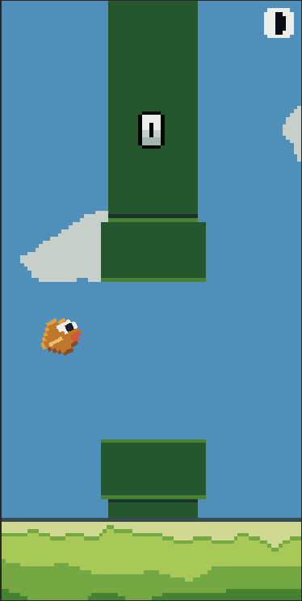
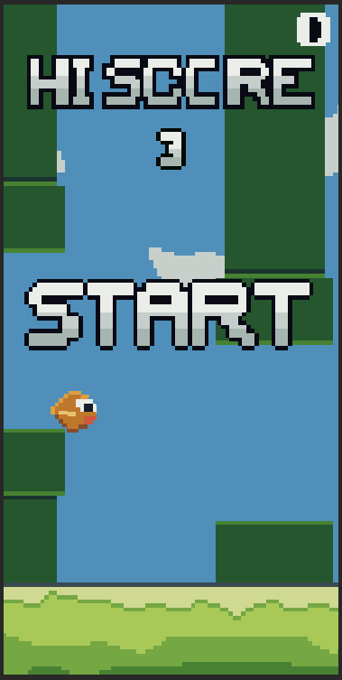
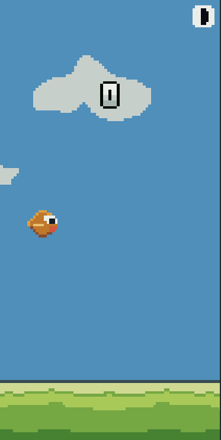

# FlappyFlap

**FlappyFlap** is a simple Flappy Bird clone built in Unity, designed for beginner programmers. Most of the game logic is kept in one file, making it easier to understand without needing deep knowledge of object-oriented programming (OOP).

You can play the game on [Itch.io](https://caliberuk.itch.io/flappyflap).

## Features
- **Unity Version:** 2022.3
- **Easy-to-read code:** Ideal for learning game development basics.
- **Aseprite project files included:** Feel free to modify and use them.
- **Audio created with [sfxr](https://sfxr.me/):** Simple retro sound effects.

## Screenshots

    
    
    

## Getting Started
1. Download or clone the repository.
2. Open the project in Unity (2022.3 or newer).
3. Explore and modify the game as you like.
4. Game.cs is the starting point. (Assets/Scripts/Game.cs)

## License
This project is free to download and use for any purpose.
